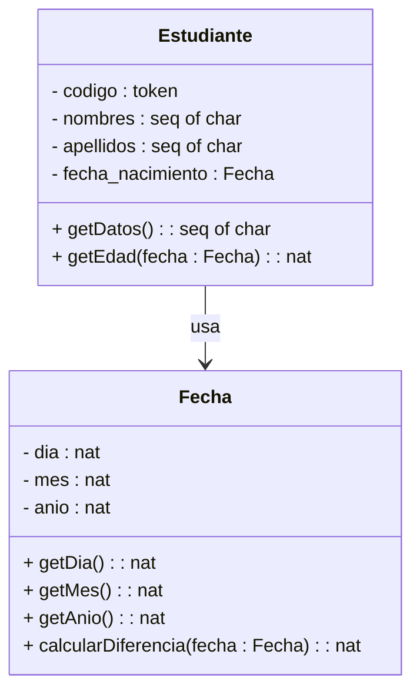

# Comandos a ejecutar

Casos de pruebas 
1. Clase Fecha (considera que para la prueba se uso la fecha de 26/11/2025):

| Metodo             | Valores de entrada | Descripcion |
|:-------------------|:-------------------|:--------------|
| calcularDiferencia | fecha = 05/12/2005 | mes antes, dias antes|
| calcularDiferencia | fecha = 29/12/2005 | mes antes, dias despues|
| calcularDiferencia | fecha = 24/11/2004 | mismo mes, dias antes|
| calcularDiferencia | fecha = 27/11/2004 | mismo mes, dias despues|
| calcularDiferencia | fecha = 02/09/2005 | mes despues, dias antes|
| calcularDiferencia | fecha = 29/09/2005 | mes despues, dias despues|
| calcularDiferencia | fecha = 07/04/2004 | bisiesto (multiplo de 4)|
| calcularDiferencia | fecha = 28/02/1900 | no bisiesto (multiplo de 100) |
| calcularDiferencia | fecha = 05/02/2000 | bisiesto (multiplo de 400)|
| calcularDiferencia | fecha = 05/02/2025 | mismo año, mes antes, dia antes|
| calcularDiferencia | fecha = 25/02/2025 | mismo año, mes antes, dia despues|
| calcularDiferencia | fecha = 05/12/2025 | mismo año, mes igual, dia antes|


```vpp
tcov reset
create test := new Test()
print test.ProbarFecha()
print test.ProbarEstudiante()
tcov write vdm.tc
rtinfo vdm.tc
```

## Grafico de clases



