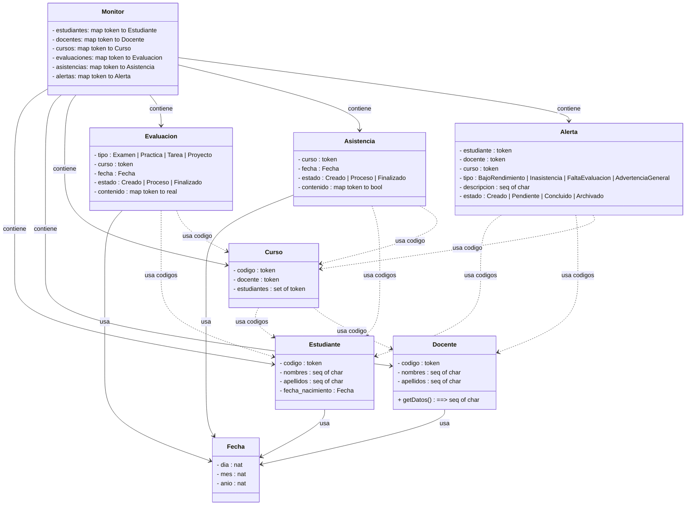

Diagrama de Clases

```mermaid
classDiagram
class Fecha {
    - dia : nat
    - mes : nat
    - anio : nat
}

class Estudiante {
    - codigo : token
    - nombres : seq of char
    - apellidos : seq of char
    - fecha_nacimiento : Fecha
}

class Docente {
    - codigo : token
    - nombres : seq of char
    - apellidos : seq of char
    + getDatos() ==> seq of char
}

class Curso {
    - codigo : token
    - docente : token
    - estudiantes : set of token
}

class Asistencia {
    - curso : token
    - fecha : Fecha
    - estado : Creado | Proceso | Finalizado
    - contenido : map token to bool
}

class Evaluacion {
    - tipo : Examen | Practica | Tarea | Proyecto
    - curso : token
    - fecha : Fecha
    - estado : Creado | Proceso | Finalizado
    - contenido : map token to real
}

class Alerta {
    - estudiante : token
    - docente : token
    - curso : token
    - tipo : BajoRendimiento | Inasistencia | FaltaEvaluacion | AdvertenciaGeneral
    - descripcion : seq of char
    - estado : Creado | Pendiente | Concluido | Archivado
}

class Monitor {
    - estudiantes: map token to Estudiante
    - docentes: map token to Docente
    - cursos: map token to Curso
    - evaluaciones: map token to Evaluacion
    - asistencias: map token to Asistencia
    - alertas: map token to Alerta
}

Estudiante --> Fecha : usa
Docente --> Fecha : usa
Curso ..> Estudiante : usa codigos
Curso ..> Docente : usa codigo
Asistencia --> Fecha : usa
Asistencia ..> Estudiante : usa codigos
Asistencia ..> Curso : usa codigo
Evaluacion --> Fecha : usa
Evaluacion ..> Estudiante : usa codigos
Evaluacion ..> Curso : usa codigo
Alerta ..> Estudiante : usa codigos
Alerta ..> Docente : usa codigos
Alerta ..> Curso : usa codigo
Monitor --> Estudiante : contiene
Monitor --> Docente : contiene
Monitor --> Curso : contiene
Monitor --> Evaluacion : contiene
Monitor --> Asistencia : contiene
Monitor --> Alerta : contiene
```