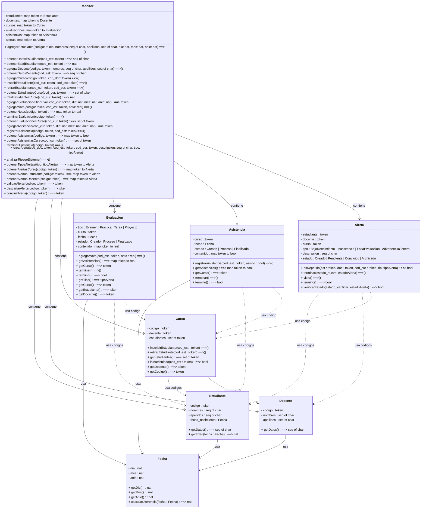

Diagrama de Clases con metodos

```mermaid
classDiagram
class Fecha {
    - dia : nat
    - mes : nat
    - anio : nat
    + getDia() : nat
    + getMes() : nat
    + getAnio() : nat
    + calcularDiferencia(fecha : Fecha) ==> nat
}

class Estudiante {
    - codigo : token
    - nombres : seq of char
    - apellidos : seq of char
    - fecha_nacimiento : Fecha
    + getDatos() ==> seq of char
    + getEdad(fecha : Fecha) ==> nat
}

class Docente {
    - codigo : token
    - nombres : seq of char
    - apellidos : seq of char
    + getDatos() ==> seq of char
}

class Curso {
    - codigo : token
    - docente : token
    - estudiantes : set of token
    + inscribirEstudiante(cod_est : token) ==> ()
    + retirarEstudiante(cod_est : token) ==> ()
    + getEstudiantes() ==> set of token
    + isMatriculado(cod_est : token) ==> bool
    + getDocente() ==> token
    + getCodigo() ==> token
}

class Asistencia {
    - curso : token
    - fecha : Fecha
    - estado : Creado | Proceso | Finalizado
    - contenido : map token to bool
    + registrarAsistencia(cod_est : token, asistio : bool) ==> ()
    + getAsistencias() ==> map token to bool
    + getCurso() ==> token
    + terminar() ==> ()
    + termino() ==> bool
}

class Evaluacion {
    - tipo : Examen | Practica | Tarea | Proyecto
    - curso : token
    - fecha : Fecha
    - estado : Creado | Proceso | Finalizado
    - contenido : map token to real
    + agregarNota(cod_est : token, nota : real) ==> ()
    + getAsistencias() ==> map token to real
    + getCurso() ==> token
    + terminar() ==> ()
    + termino() ==> bool
    + getTipo() ==> tipoAlerta
    + getCurso() ==> token
    + getEstudiante() ==> token
    + getDocente() ==> token
}

class Alerta {
    - estudiante : token
    - docente : token
    - curso : token
    - tipo : BajoRendimiento | Inasistencia | FaltaEvaluacion | AdvertenciaGeneral
    - descripcion : seq of char
    - estado : Creado | Pendiente | Concluido | Archivado
    + esRepetido(est : token, doc : token, cod_cur : token, tip: tipoAlerta) ==> bool
    + terminar(estado_nuevo: estadoAlerta) ==> ()
    + visto() ==> ()
    + termino() ==> bool
    + verificarEstado(estado_verificar: estadoAlerta) ==> bool
}

class Monitor {
    - estudiantes: map token to Estudiante
    - docentes: map token to Docente
    - cursos: map token to Curso
    - evaluaciones: map token to Evaluacion
    - asistencias: map token to Asistencia
    - alertas: map token to Alerta
    + agregarEstudiante(codigo: token, nombres: seq of char, apellidos: seq of char, dia: nat, mes: nat, anio: nat) ==> ()
    + obtenerDatosEstudiante(cod_est: token) ==> seq of char
    + obtenerEdadEstudiante(cod_est: token) ==> nat
    + agregarDocente(codigo: token, nombres: seq of char, apellidos: seq of char) ==> ()
    + obtenerDatosDocente(cod_est: token) ==> seq of char
    + agregarCurso(codigo: token, cod_doc: token) ==> ()
    + inscribirEstudiante(cod_cur: token, cod_est: token) ==> ()
    + retirarEstudiante(cod_cur: token, cod_est: token) ==> ()
    + obtenerEstudiantesCurso(cod_cur: token) ==> set of token
    + totalEstudiantesCurso(cod_cur: token) ==> nat
    + agregarEvaluacion(t:tipoEval, cod_cur: token, dia: nat, mes: nat, anio: nat) ==> token
    + agregarNota(codigo: token, cod_est: token, nota: real) ==> ()
    + obtenerNotas(codigo: token) ==> map token to real
    + terminarEvaluacion(codigo: token) ==> ()
    + obtenerEvaluacionesCurso(cod_cur: token) ==> set of token
    + agregarAsistencia(cod_cur: token, dia: nat, mes: nat, anio: nat) ==> token
    + registrarAsistencia(codigo: token, cod_est: token) ==> ()
    + obtenerAsistencias(codigo: token) ==> map token to bool
    + obtenerAsistenciasCurso(cod_cur: token) ==> set of token
    + terminarAsistencia(codigo: token) ==> ()
    + crearAlerta(cod_doc: token, cod_est: token, cod_cur: token, descripcion: seq of char, tipo: tipoAlerta)
    + analizarRiesgoSistema() ==> ()
    + obtenerTiposAlertas(tipo: tipoAlerta) ==> map token to Alerta
    + obtenerAlertasCurso(codigo: token) ==> map token to Alerta
    + obtenerAlertasEstudiante(codigo: token) ==> map token to Alerta
    + obtenerAlertasDocente(codigo: token) ==> map token to Alerta
    + validarAlerta(codigo: token) ==> token
    + descartarAlerta(codigo: token) ==> token
    + concluirAlerta(codigo: token) ==> token
}

Estudiante --> Fecha : usa
Docente --> Fecha : usa
Curso ..> Estudiante : usa codigos
Curso ..> Docente : usa codigo
Asistencia --> Fecha : usa
Asistencia ..> Estudiante : usa codigos
Asistencia ..> Curso : usa codigo
Evaluacion --> Fecha : usa
Evaluacion ..> Estudiante : usa codigos
Evaluacion ..> Curso : usa codigo
Alerta ..> Estudiante : usa codigos
Alerta ..> Docente : usa codigos
Alerta ..> Curso : usa codigo
Monitor --> Estudiante : contiene
Monitor --> Docente : contiene
Monitor --> Curso : contiene
Monitor --> Evaluacion : contiene
Monitor --> Asistencia : contiene
Monitor --> Alerta : contiene
```